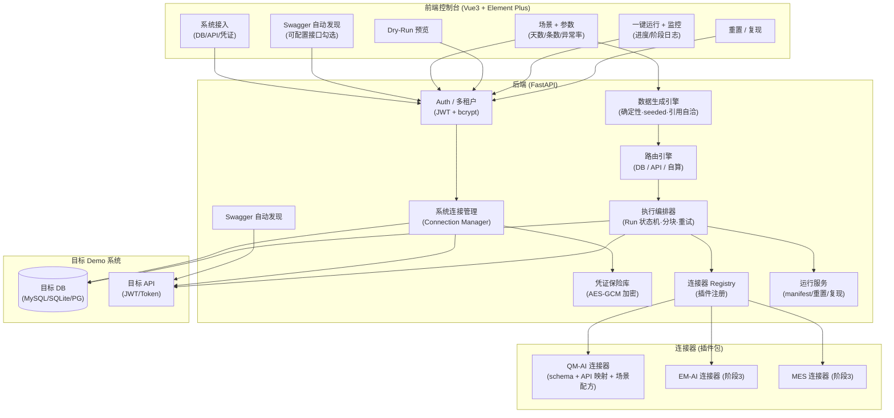
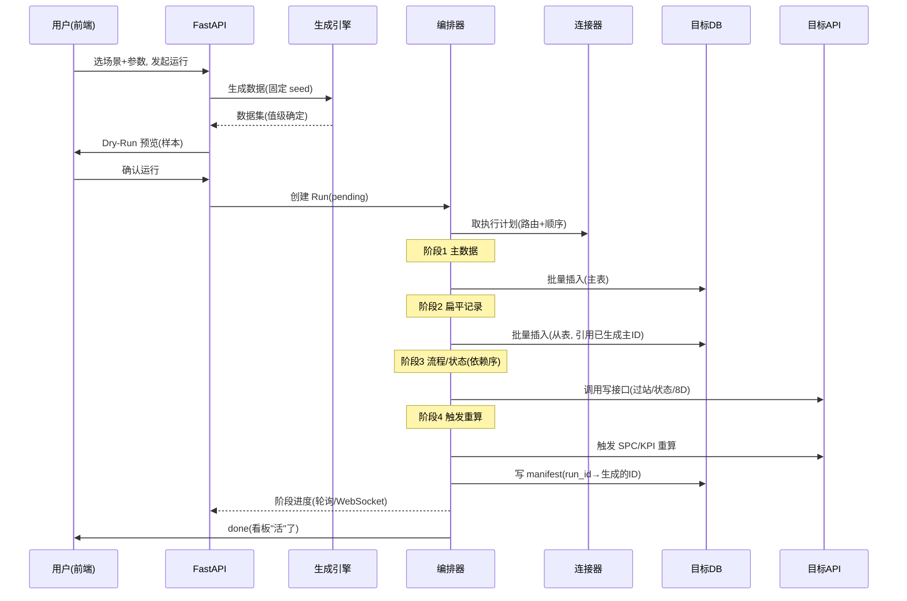
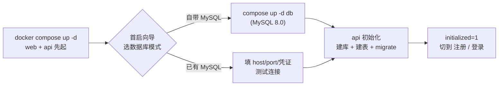

# AutoDemoDataGem — 技术实现方案

> 对应 `01.产品方案.md`。本文回答"**怎么把它做出来**"：架构、模块、数据模型、核心引擎（确定性生成 / 自动选路 / 可复现）、连接器插件、安全、部署、MVP 任务拆解。
> 阶段 1（MVP）目标：**QM-AI 连接器端到端跑通，DB + API 双通道都证明**。

---

## 0. 范围与技术决策摘要

### 0.1 技术栈

| 层 | 选型 | 理由 / 备选 |
|----|------|------------|
| 后端框架 | **Python 3.12 + FastAPI** | 产品方案已定；写库/调 API/生成数据生态最全，与目标系统栈解耦 |
| 异步 | 全异步（`httpx` + `asyncmy`/`aiomysql` + `aiosqlite` 过渡） | 目标系统多为远程，IO 密集，异步吞吐好 |
| ORM / 目标库 | **SQLAlchemy 2.0**（SaaS 自库）；目标库用**原生 async 驱动 + 裸 SQL** | 目标库 schema 千差万别，裸 SQL + 参数化最稳，不强行 ORM 化目标库 |
| SaaS 自库 | **MySQL 8.0** | 与目标系统栈统一（QM-AI 即 MySQL 8.0，一个镜像/运维熟悉/DB 驱动复用）；JSON 列存参数/配方；本地开发可用 SQLite 过渡 |
| 鉴权 | **JWT（PyJWT）+ passlib[bcrypt]** | 注册即用，无状态，多端友好 |
| 凭证加密 | **cryptography（AES-GCM / Fernet）** | 生产可用、同步、简单；密钥单一来源（env），无 env 不生效 |
| 数据生成 | **numpy（分布/seeded）+ Faker（seeded，文本味）** | 自研保证"可复现 + 分布控制 + 引用自洽"；Faker 只负责人名/地址/设备名等"看着像人写的"文本，同样固定 seed |
| Swagger 解析 | 轻量 OpenAPI 解析（`prance` 或直接 json 遍历） | 只取写接口 + 请求体 schema，不做全量校验 |
| 前端 | **Vue 3 + Vite + TypeScript + Element Plus + Pinia + axios + ECharts** | 与现有生态一致；非技术用户一等公民；ECharts 用于预览/监控 |
| 部署 | **Docker Compose 单机**（`api` + `web`(nginx) + `db`） | 产品方案已定；单机够用，后续再谈扩展 |

### 0.2 关键决策（含备选，待你确认）

| # | 决策点 | 我的选择 | 备选 | 理由 |
|---|--------|---------|------|------|
| D1 | **执行模型** | **进程内异步任务**（FastAPI 后台任务 + 轮询/WebSocket 进度） | Celery + Redis（独立 worker） | MVP 单机够用、少一个组件；"数据不离开系统"。量上来再上 Celery（预留接口） |
| D2 | **"自动选路"的语义** | **连接器声明式路由**（专家知识写进配方，用户无感） | ML 自动检测 | 产品文档的"自动"= 用户不用管，不是 AI 猜。连接器按系统特性声明每条数据走 DB/API/自算，可靠、可控、可复现 |
| D3 | **复现的粒度** | **值级复现**（同参数→同内容，DB 自增 ID 可不同）；**ID 钉住**为可选项（schema 允许显式 ID 时） | 强制同 ID | 大多数目标库自增 ID 无法控制；值级复现已满足"看起来一样"。需要"和上次抓的快照完全一致"时才启用 ID 钉住 |
| D4 | **连接器形态** | **进程内 Python 插件包**（一个系统 = 一个包，注册进 registry） | 独立微服务 | 简单、隔离够用；插件间通过"场景配方"声明，互不依赖 |
| D5 | **前端形态** | **Web 管理台**（Vue3 + Element Plus） | 纯 CLI | 产品要求"非技术用户也能配"，必须可视化 |
| D6 | **SaaS 自库** | **MySQL 8.0** | SQLite（MVP 过渡） | 与目标系统栈统一（QM-AI 即 MySQL 8.0）；一个镜像、运维熟悉、DB 驱动复用；JSON 列存参数/配方 |
| D7 | **部署方式** | **Docker Compose 单机**（`web`(nginx) 先启动 + 首启设置向导 + `db` + `api`） | 裸机部署 | 产品已定 Docker；**Web 端先启动、不依赖 DB**，向导可选「自带 MySQL / 已有 MySQL」，兼容本地已有 MySQL |

### 0.3 待核实（来自产品方案 §10，MVP 第 1 步先核实，不阻塞方案）

| # | 待核实项 | 影响 | 核实动作 |
|---|---------|------|---------|
| Q1 | **QM-AI 写 API 清单 + 鉴权**（哪些 POST/PUT/PATCH、JWT 登录 `POST /api/auth/login`、Bearer） | API 通道（流程/状态型）能否落地 | 抓 swagger + 实测登录 + 逐个探写接口 |
| Q2 | **QM-AI DB schema**（灌哪些表、外键关系、字段语义） | DB 通道路由 + 字段映射 | 导出 DDL / 读迁移文件 / 抽样看数据 |
| Q3 | **Swagger 线上是否开启**（实测仅 Development 开） | 自动发现能否在生产 Demo 用 | 线上抓一次 `/swagger/v1/swagger.json`；不行就首次抓取存缓存 |

> **兜底**：Q1/Q2 未核实前，方案按"连接器骨架 + 可插拔 schema/recipe 配置"实现，核实后把 QM-AI 的表/接口填进配置文件即可，**不改核心引擎**。

---

## 1. 总体架构

### 1.1 架构图



### 1.2 组件职责

| 组件 | 职责 | 关键约束 |
|------|------|---------|
| Auth/多租户 | 注册/登录、JWT、**所有查询强制带 `tenant_id`** | 租户隔离是硬约束，漏一处 = 数据串号 |
| 系统连接管理 | 存目标系统（DB 连接串 / API base + 凭证）、**连接测试** | 凭证只在保险库明文存在，响应一律脱敏 |
| 凭证保险库 | AES-GCM 加解密，密钥 env 单一来源 | 无密钥不生效（明确报错）；前端只存密文 |
| Swagger 自动发现 | 登录→抓 swagger→解析写接口+schema→"可配置接口"清单 | 线上只 Development 开 → 首次抓取缓存 |
| **数据生成引擎** | 按 seed 生成"活"的数据（时间锚/分布/引用自洽/异常） | **核心**：同 seed → 同内容；引用必须真实 |
| **路由引擎** | 按配方把每条数据分到 DB / API / 自算 | 声明式，用户无感 |
| **执行编排器** | Run 状态机，分阶段执行、分块、重试、幂等 | 写前 dry-run；写后自洽校验 |
| 连接器 Registry | 插件注册/发现，按系统类型路由到连接器 | 支持新系统 = 加一个包 |
| 运行服务 | manifest（写清单）、重置、复现 | 重置 = 按 manifest 删，不 truncate 真数据 |

### 1.3 一次"一键灌入"的时序



---

## 2. 后端模块设计

### 2.1 Auth & 多租户
- 表：`users(id, tenant_id, username, password_hash, role, status, created_at)`、`tenants(id, name, plan, created_at)`。
- 注册即用：注册时建 tenant（一人一租户，MVP 不建团队概念）。
- JWT：`sub=user_id`、`tid=tenant_id`、`exp`。**每个 repository 查询强制注入 `WHERE tenant_id = ?`**（用依赖注入 + 基类 `_tenant_scope()`，杜绝裸表查询）。
- 角色：MVP 只有 `owner`（本人）；预留 `member`。

### 2.2 系统连接管理（Connection Manager）
- 一个"系统"= 用户接入的一个 Demo 实例，可挂 DB 和/或 API（至少其一，符合产品 §6 门槛）。
- **连接测试**：
  - DB：建连接 → 探 schema（列名/类型/主键/外键）→ 抽样 N 行 → 返回健康报告。
  - API：走登录 → 拿 token → 探 swagger → 探 1 个只读接口 → 返回健康报告。
- **适配层**：`DBDriver` 抽象（`mysql`/`sqlite`/`postgres`）+ `ApiClient`（登录策略可插拔：JWT / basic / header token）。
- 目标库 schema 探测结果**缓存**到系统记录（`schema_cache` JSON 列），供连接器做字段映射与 dry-run。

### 2.3 凭证保险库（Credential Vault）
- 加密：`AES-GCM`（`cryptography`），**每记录一个随机 nonce**，密文 + nonce + tag 存库。
- 密钥：**env 单一来源** `VAULT_KEY`（32B）。**无密钥 → 启动即失败**（明确报错，不 fallback）。
- 规则：
  - 前端**只存/只回显脱敏**（如 `passw…1234`、DB host + 端口，不返回 password 明文）。
  - 明文只在内存中出现（执行时解密 → 用完即弃）。
  - 永不写日志、永不回 API。

### 2.4 数据生成引擎（灵魂）
> 详细设计见 §4。这里给接口与产物。

- 输入：`scene_id + params + system_schema`；输出：**有序数据集**（每张表/每个接口的一条条记录，已按依赖拓扑排好）。
- 特性：
  1. **固定 seed**（§4.1）→ 同参数同内容。
  2. **时间锚 now**：以当前时间为基准向前铺 N 天，实时/趋势有数据。
  3. **引用自洽**：先生成主表，从表引用"真实生成出来"的主 ID。
  4. **分布控制**：数值落规格内、状态按真实比例、可注入异常（红点）。
  5. **分块**：大数据集分批产出，编排器分批落库（防一次撑爆内存/目标库）。

### 2.5 路由引擎（自动选路）
- 场景配方里，每个"数据元素"带 `route` 标签：
  - `db`：直接写库（扁平记录/主数据/历史）——快、"看得到"。
  - `api`：走系统写接口推进（工单过站、设备状态流转、8D）——避免"插库假死"。
  - `compute`：**不直接写**，触发系统自算（SPC/不良率/KPI），再校验结果。
- 引擎只按标签分发；**判断"哪条走哪路"是连接器专家知识**，写进配方（§0.2-D2）。用户永远看不到"选路"这个概念。

### 2.6 执行编排器（Run 状态机）
- **Run** 生命周期：`pending → running(phase…) → done | failed | cancelled`。
- **阶段**（顺序、可断点）：
  1. 主数据（DB）
  2. 扁平记录（DB，引用主 ID）
  3. 流程/状态（API，依赖序）
  4. 触发重算（API）+ 自洽校验
- **鲁棒性**：
  - **Dry-Run 先行**：先产出样本 + 预估写入量，用户确认才真写（兜底：防误写真实状态）。
  - **幂等 + manifest**：每 Run 记录"写了哪些 ID"（§2.9），重试不重复写。
  - **重试/退避**：API 调用失败退避重试；超限则 Run 失败 + 精确到"哪条接口哪条数据"。
  - **限流**：对目标系统 API 限速（避免把 Demo 系统打挂）。
  - **进度**：每阶段完成度 → 轮询 / WebSocket 推给前端。

### 2.7 连接器插件 + QM-AI
- 插件接口见 §5。Registry 扫描 `connectors/` 包，读每个包的 `manifest.yaml`（`system_type`、`routes`、`scenes`）注册。
- **QM-AI 连接器（MVP 唯一目标）**：
  - 主数据：产品 / 设备 / 操作员 / 工单 → **DB**。
  - 历史检验记录 → **DB**（时间锚 + 分布 + 异常）。
  - 活跃 / SPC / 8D 流程态 → **API**（依赖序推进）。
  - SPC/KPI/不良率 → **compute**（触发重算 + 校验）。
  - 具体表/接口/字段 = Q1/Q2 核实后填入 `schema.yaml` / `api_map.yaml` / `scenes/*.yaml`（**配置化，不改引擎**）。

### 2.8 Swagger 自动发现
- 流程：`base_url + 凭证` → 自动登录拿 token → `GET /swagger/v1/swagger.json`（或 `/openapi.json`，可配）→ 解析：
  - 所有**写接口**（POST/PUT/PATCH/DELETE）+ 请求体 schema（字段/类型/必填）。
  - 鉴权方式（从 securitySchemes 读：JWT Bearer 等）。
- 产物：**"可配置接口"清单** → 前端勾选 + 字段映射 → 存入系统记录（`configurable_interfaces` JSON 列）→ 场景配方引用。
- 占连接器 API 部分约 70%（接口清单/入参/鉴权自动给）；**仍需人工标注**：哪条是流程/状态型、调用顺序（依赖）、业务合理取值、重算触发点、写后自洽校验（产品 §6）。
- **无 Swagger**：退回连接器声明的手动 API 映射。
- **缓存**：线上只 Development 开 → 首次抓到就存 `swagger_cache`，后续复用（Q3 兜底）。

### 2.9 运行服务：manifest / 重置 / 复现
- **manifest**：`run_manifest(run_id, table, id)` 记录本 Run 写入的每条 ID（DB 与 API 返回 ID 都记）。
- **复现**：同参数 → 同 seed → 同内容（值级，§0.2-D3）。可选"ID 钉住"模式（schema 允许显式 ID 时）。
- **重置**：`DELETE WHERE id IN (本 Run manifest)`——只清工具灌的，**不动系统真实数据**；然后可重新 Run 得到干净一套。
- 提供"清空本系统全部工具数据"（按系统维度的 manifest 汇总）。

---

## 3. 数据模型（SaaS 自库 schema）

```mermaid
erDiagram
  tenants ||--o{ users : has
  tenants ||--o{ systems : owns
  systems ||--o{ runs : has
  runs ||--o{ run_logs : has
  runs ||--o{ run_manifest : has

  tenants {
    int id PK
    string name
    string plan
    ts created_at
  }
  users {
    int id PK
    int tenant_id FK
    string username
    string password_hash
    string role
    string status
    ts created_at
  }
  systems {
    int id PK
    int tenant_id FK
    string name
    string system_type        % qm-ai / em-ai / mes
    string db_driver          % mysql|sqlite|postgres|none (目标系统库)
    string db_conn_enc        % 加密的连接串
    string api_base
    string api_auth_enc       % 加密的凭证
    json schema_cache        % 探测的目标库 schema
    json swagger_cache       % 首次抓取的 swagger
    json configurable_ifaces % 勾选+映射后的可配置接口
    ts created_at
  }
  runs {
    int id PK
    int tenant_id FK
    int system_id FK
    string scene_id
    json params              % 天数/条数/异常率…
    string seed               % 固定种子
    string status             % pending|running|done|failed|cancelled
    int progress              % 0-100
    json phase_state         % 各阶段进度
    ts started_at
    ts finished_at
  }
  run_logs {
    int id PK
    int run_id FK
    string phase
    string level              % info|warn|error
    string message
    ts created_at
  }
  run_manifest {
    int id PK
    int run_id FK
    string scope              % db|api
    string table_or_endpoint
    string id
  }
  settings {
    int id PK
    int tenant_id FK
    string key
    string value
  }
```

> 说明：场景（scene）是**连接器内建**的（每个连接器声明自己的场景清单），不进 SaaS 自库；用户的"选择 + 参数"记在 `runs.params`。若要支持用户自定义场景，阶段 3 再抽 `scenes` 表。

---

## 4. 数据生成引擎详细设计（核心）

### 4.1 种子派生（可复现的根）

```
seed = sha256( tenant_id | system_id | scene_id | canonical(params) )  # 64bit → PRNG
rng  = numpy.random.default_rng(seed)
faker = Faker('zh_CN'); faker.seed_instance(seed)
```
- `canonical(params)`：参数 dict 做**键排序 + 稳定序列化**，保证同参数 → 同 seed。
- 所有随机量（数值/状态/时间/文本）**只从 `rng` / `faker` 取** → 全确定。

### 4.2 时间锚（"时间新鲜"）

```
anchor = now
for 每条记录: t = anchor - rng.uniform(0, N_days)*86400   # 落在近 N 天
按业务加"实时尾巴"：最近 24h 内再密集补一批 → 实时/趋势图有数据
```
- 时间序列类（趋势/SPC）：固定步长铺点 + 少量抖动，保证曲线自然。

### 4.3 引用自洽（"有关系"）

- 场景配方声明**实体依赖图（DAG）**，按拓扑序生成：
  ```
  产品/设备/操作员/工单(主) → 检验记录(从, 引用工单/设备) → SPC/8D(引用检验记录)
  ```
- 从表的外键值 = **前序真实生成的主 ID**（不是随机编的）→ 绝不出现"指向不存在工单"。

### 4.4 分布控制（"分布合理 + 有异常"）

每个字段一个 **Generator 规格**（声明式，写进配方）：

```yaml
inspection_result:
  type: categorical
  distribution: { pass: 0.85, warn: 0.10, fail: 0.05 }   # 真实比例
dimension_mm:
  type: normal
  mu: 10.0; sigma: 0.02; spec: [9.95, 10.05]   # 落在规格内
  anomaly_rate: 0.03                             # 3% 故意出格 → 看板红点
defect_count:
  type: poisson
  lam: 0.4
```
- **异常注入**是**显式可控**的（参数 `anomaly_rate`），保证"看板有红点、有故事可讲"，而不是全绿。

### 4.5 复现模型（值级 vs ID 钉住）

| 模式 | 说明 | 适用 |
|------|------|------|
| **值级复现（默认）** | 同参数→同 seed→同**内容**；目标库自增 ID 可不同 | 绝大多数目标库 |
| **ID 钉住（可选）** | 显式插入固定 ID（`id = base + index`），两次 Run ID 完全一致 | schema 允许显式 ID 且需要"和上次快照逐 ID 一致" |

> 值级已满足"看起来一样 + 可复现"；ID 钉住是增强，按需开。

### 4.6 生成伪代码

```python
def generate(scene, params, schema, seed):
    rng, faker = make_rng(seed)
    plan = scene.dependency_dag()          # 拓扑序
    out = {}
    for entity in topological(plan):       # 主→从
        rows = []
        for i in range(entity.count):      # count 来自 params(条数)
            row = {}
            for field, spec in entity.fields.items():
                row[field] = spec.gen(rng, faker, anchor=now, **params)
            # 外键引用已生成的主实体
            for fk in entity.fks:
                row[fk] = pick(rng, out[fk.ref])
            rows.append(row)
        out[entity] = rows
    return ExecutionPlan(out, routes=scene.routes())   # 附路由标签
```

---

## 5. 连接器接口（代码骨架）

```python
# connectors/qm_ai/connector.py
from core.connector import BaseConnector

class QMAIConnector(BaseConnector):
    system_type = "qm-ai"          # manifest 声明
    def routes(self, scene): ...   # 返回每条数据的 route: db|api|compute
    def build(self, scene, params, schema) -> ExecutionPlan:
        # 调生成引擎，按 schema 填 QM-AI 真实字段/表
        ...
    def validate_connection(self, conn) -> HealthReport: ...
    def reset(self, conn, run_id) -> int: ...   # 按 manifest 删
    def trigger_recompute(self, conn, keys) -> bool: ...  # compute 路由
```

**目录约定**（支持新系统 = 加一个包）：
```
connectors/
  qm_ai/
    manifest.yaml        # system_type, 支持的 routes, 场景清单
    schema.yaml          # 表/字段/外键/字段语义  ← Q2 核实后填
    api_map.yaml         # 写接口/鉴权/调用顺序/依赖  ← Q1 核实后填
    scenes/
      inspection.yaml    # 场景: 字段 Generator 规格 + route 标签
      eight_d.yaml
    connector.py
```

**场景配方结构**（`scenes/inspection.yaml` 示例）：
```yaml
scene: qm-ai/inspection
entities:
  product:      { count: {param: products},  fields: {...}, route: db }
  work_order:   { count: {param: orders},    fields: {...}, route: db,
                  fks: [product] }
  inspection:   { count: {param: records},   fields: {...}, route: db,
                  fks: [work_order, product, machine],
                  time_anchor: {days: {param: days}} }
  spc:          { route: compute, trigger: /api/spc/recalc, verify: pass_rate }
  eight_d:      { count: {param: eight_d},   route: api,
                  endpoint: /api/eight_d, order: [create, update_status] }
```

---

## 6. 前端控制台

| 页面 | 关键交互 |
|------|---------|
| 登录 / 注册 | 注册即用，JWT 存 localStorage |
| 系统列表 / 新建系统 | 表单：DB 连接串 / API base + 凭证；**连接测试**按钮（健康报告回显） |
| Swagger 发现 | 触发抓取 → **"可配置接口"清单**（勾选 + 字段映射） |
| 场景 + 参数 | 选场景 → 调参（天数/条数/异常率…，**滑块 + 数值**，非技术友好） |
| Dry-Run 预览 | 展示样本数据（表格 + 几张 ECharts 预览图：趋势/分布/状态占比）→ 预估写入量 |
| 一键运行 + 监控 | 运行中：**阶段进度条 + 实时日志流**（WebSocket/轮询）；失败定位到"哪条接口哪条数据" |
| 重置 / 复现 | 一键重置（按 manifest 清工具数据）；同参数复现；"清空本系统全部工具数据" |

- 规范：禁 emoji，图标用 ant/Element SVG；模态窗 centered + maxHeight；Tab 激活 `#3B82F6`。
- 状态卡不用左彩色竖条（去 AI 味）；KPI 卡细边框 + 语义色数字。

---

## 7. 安全设计

| 面 | 措施 |
|----|------|
| 凭证加密 | AES-GCM，密钥 env 单一来源（`VAULT_KEY`），**无密钥不启动**；每记录随机 nonce |
| 租户隔离 | 所有 repository 查询强制 `tenant_id` 作用域（基类注入），杜绝串号 |
| 脱敏 | 凭证只回显末 4 位 / host+port，**明文永不出 API、不进日志** |
| 目标系统保护 | **Dry-Run 先行**、API 限速、写接口白名单（连接器声明）、失败退避 |
| 注入防护 | 目标库一律**参数化 SQL**，不拼字符串 |
| 审计 | Run 全程留 log（操作人/参数/阶段/结果），manifest 可追溯"灌了什么" |
| 越权 | 非本人系统不可操作（`system.tenant_id == token.tid` 强校验） |

---

## 8. 部署（Docker Compose 单机 · Web 先启动 + 首启向导）

### 8.1 启动模型（两阶段）

- **阶段 1 — Web 先启动**：`docker compose up -d` 只起 `web` + `api`（**两者都不强制依赖数据库**）。打开 `http://<host>:8860` 看到的是**首启设置向导**（不是登录页）。
- **阶段 2 — 初始化**：用户在向导里选数据库模式 → 测试连接 → 初始化（建库/建表 + 标记 `initialized`）→ 前端自动切到「注册 / 登录」，进入正常流程。

### 8.2 首启设置向导（Web 端 · 数据库 Options）

未初始化时，Web 端唯一入口就是这个向导，提供**数据库 Options**：

1. **数据库模式（二选一）**
   - **自带 MySQL（推荐）**：用 Compose 内置 `db`（MySQL 8.0）。点「启动并初始化」→ 后台 `docker compose up -d --profile builtin-db db` → api 连内置库建表。
   - **使用已有 MySQL**：填 `host / port / user / password / database` → 点「**测试连接**」（实时回显成功/失败/延迟）→「初始化」。**兼容本地 / 服务器上已有 MySQL**。
2. **初始化动作**：连库 → `CREATE DATABASE IF NOT EXISTS` → 建表（migrate）→ 写 `settings.initialized=1` → 成功 → 前端跳注册页。
   - **已有 MySQL 兼容细节**：
     - 目标库需**建表权限**；若权限不足，向导提供「**导出建表 SQL**」按钮，用户手动执行后点「已建好，重新检测」。
     - 连接串只在初始化时提交一次，随后按凭证保险库规则**加密存入 `settings`**，前端此后不再回显明文。
3. **状态机**：`GET /api/status` 返回 `{initialized, db: ok|none, mode: builtin|external|none}`；`initialized=false` 时前端**只渲染向导**，`true` 后才渲染控制台（注册/登录/系统/场景…）。



### 8.3 Compose

```yaml
services:
  web:            # nginx 托管 Vue 产物；先启动、不依赖任何服务
    build: ./web
    ports: ["8860:80"]

  api:            # FastAPI；启动不强制要求 DB 就绪（setup 阶段可用）
    build: ./api
    environment:
      VAULT_KEY: ${VAULT_KEY}
      JWT_SECRET: ${JWT_SECRET}
      # 初始化前不设 DATABASE_URL；由首启向导写入 settings 后生效
    ports: ["8861:8000"]

  db:             # 自带 MySQL 8.0；按需启动（向导选"自带"才拉起）
    image: mysql:8.0
    profiles: ["builtin-db"]
    environment:
      MYSQL_ROOT_PASSWORD: ${MYSQL_ROOT_PASSWORD}
      MYSQL_DATABASE: autodemo
    volumes: [mysql_data:/var/lib/mysql]
    healthcheck:
      test: ["CMD-SHELL", "mysqladmin ping -h localhost -uroot -p$MYSQL_ROOT_PASSWORD"]
      interval: 10s
      timeout: 5s
      retries: 5
volumes: { mysql_data: {} }
```

**启动方式**
- 只起 Web（首启）：`docker compose up -d`（web + api；`db` 在 profile，不自动起）。
- 自带 MySQL：向导触发 `docker compose up -d --profile builtin-db db`。
- 已有 MySQL：不用内置 `db`，api 直连外部库。

### 8.4 约定

- **端口**：web `8860`（对外）；api `8861`（内网/反代）；内置 MySQL `3306`（仅本机、按需）。
- **部署位置**：默认同机 `uantek@nat.ywapi.com`，**独立 Compose 项目 + 独立端口**，与 MES-v24 命名空间隔离（待确认是否同机）。
- **健康检查**：`GET /api/health` → `{initialized, db}`；前端 Nginx 反代 `/api → api:8000`。
- **密钥**：`VAULT_KEY` / `JWT_SECRET` / `MYSQL_ROOT_PASSWORD` 走 `.env`（gitignore），**不设不生效**。

---

## 9. MVP 任务拆解（阶段 1，每项 30–60min，带验收标准）

> 原则：环境重型（装依赖）走主进程；纯逻辑（引擎/连接器/前端页面）可拆子任务；每步验证后再进下一步。

| # | 任务 | 验收标准 |
|---|------|---------|
| **0.0** | 仓库 + 目录骨架 + 依赖 + Docker 起 web/api（DB 按需 profile） | `docker compose up -d` 起 web+api（不依赖 DB），`/api/health` 通 |
| **0.1** | 连接器 Registry 骨架 + BaseConnector 接口 | 空插件能被扫描注册 |
| **1.0** | 注册/登录 + JWT + 多租户作用域 | 注册即登录；跨租户查询 403 |
| **1.1** | 凭证保险库（AES-GCM）+ 脱敏 | 加密存/解密取；无 `VAULT_KEY` 启动失败；API 只回脱敏 |
| **1.2** | 系统 CRUD + DB 连接测试（MySQL/SQLite/PG 适配） | 填错连接报错清晰；对的能探 schema 回健康报告 |
| **1.3** | API 连接测试（登录策略 + swagger 探测） | 能登录拿 token、探到 swagger |
| **2.0** | 数据生成引擎：seed/时间锚/分布/引用自洽 | 同参数两次生成内容一致；从表外键 100% 指向已生成主 ID |
| **2.1** | 路由引擎 + 执行编排器（阶段状态机/分块/重试/限流） | 能按 route 分发；失败重试；进度可查 |
| **3.0** | **QM-AI 连接器**：核实 schema/写 API（Q1/Q2），填 schema.yaml/api_map.yaml/scenes | 连接测试通过；场景可 build 出计划 |
| **3.1** | Dry-Run 预览（样本 + 预估量） | 预览数据符合"活"的 4 条标准 |
| **3.2** | **端到端跑通**：主数据/历史走 DB + 流程态走 API + 触发重算 | 灌完看板"活"：时间新鲜/有关系/分布合理/有异常 |
| **4.0** | 前端控制台（系统接入/场景/参数/预览/运行/监控/重置） | 非技术用户能走完"接系统→选场景→调参→运行→看效果" |
| **4.1** | 重置 + 复现（manifest） | 重置只清工具数据；同参数复现内容一致 |
| **4.2** | Swagger 自动发现（可配置接口勾选+映射+缓存） | 有 swagger 的系统自动生成接口清单；无的退回手动 |
| **4.3** | **首启设置向导**（Web 先启动 + 数据库 Options：自带/已有 MySQL + 测试连接 + 建库建表） | `compose up -d` 仅起 web+api；向导选模式→测试连接→初始化→自动切注册页；已有 MySQL 可连成功 |
| **4.4** | Docker Compose 部署 + 健康检查 + .env 密钥 | 服务器上 `compose up` 起来，走通"首启→注册→接系统→灌数" |

> 阶段 2/3/4（可视化增强、第 2/3 连接器、开放注册上线）= 产品方案 §9 后续，本 MVP 不做。

---

## 10. 风险与兜底

| 风险 | 兜底 |
|------|------|
| **误写目标系统真实状态**（API 调错/重复） | Dry-Run 先行 + 写接口白名单 + manifest 幂等 + 限速；连接器只声明"安全"的写接口 |
| **目标库自增 ID 不可控** | 默认值级复现（§4.5）；需要逐 ID 一致才开 ID 钉住（schema 允许时） |
| **Swagger 线上只 Development 开** | 首次抓取存 `swagger_cache`，复用（Q3）；无 swagger 退回手动映射 |
| **目标系统不可达 / 慢** | 连接超时 + 退避重试 + 降级（跳过该阶段标记，不整体失败） |
| **大批量撑爆目标库/内存** | 分块生成 + 分块落库（可配 batch_size） |
| **Q1/Q2 未核实** | 核心引擎与连接器解耦，核实后只改 QM-AI 配置文件，不动引擎 |
| **凭证泄漏** | AES-GCM + env 单一密钥 + 全链路脱敏 + 审计 |

---

## 11. 下一步（待你拍板）

1. **确认 §0.2 的 7 个决策**（D1 执行模型 / D2 自动选路语义 / D3 复现粒度 / D4 连接器形态 / D5 前端形态 / D6 SaaS 自库 / D7 部署位置）。
2. **确认 MVP 任务拆解（§9）** 的粒度与顺序。
3. **Q1/Q2/Q3 谁来核实**：我可以去 QM-AI 实测（抓 swagger + 探写接口 + 导出 schema），或你提供 DDL/接口清单。
4. 拍板后，我按 §9 逐任务执行，**每步跑真实验证再进下一步**。

*一句话：注册 → 接系统 → 选场景 → 灌入 → 看起来真的在跑。核心 = 确定性生成引擎 + 声明式自动选路 + manifest 可复现/可重置；支持新系统 = 加一个连接器包。*
